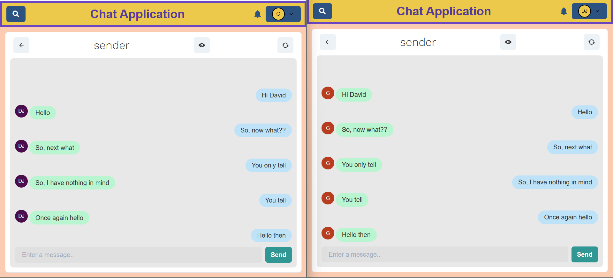

# Text-A-Lot

> A Realtime Chat Application

**Text-A-Lot** is a simple yet powerful real-time chat application built using the **MERN stack** (MongoDB, Express, React, Node.js) and **Socket.IO** for real-time communication. This application supports responsive design, making it accessible on both mobile and desktop devices.

---

## Features

- **Real-Time Communication**: One-on-one and group chat functionality with real-time updates.
- **User Authentication**: Signup/Login, Logout, and Guest Login features.
- **Chat Functionalities**:
  - Create groups, add/remove participants.
  - Online/offline user status.
  - Read/unread message tracking.
  - Typing indicators for an engaging user experience.
- **Search and Navigation**: Search users or groups with ease.
- **Persistent Data**: All user data, group chats, and conversations are stored securely in **MongoDB Atlas**.

---

### Screenshots

  
  
  
  

---

## Tech Stack

- **Frontend**: React.js with Chakra-UI for responsive and styled components.
- **Backend**: Node.js and Express.js.
- **Database**: MongoDB Atlas for secure data storage.
- **Real-Time**: Socket.IO for seamless communication.

---

## Getting Started

### Prerequisites
- Install [Node.js](https://nodejs.org/)
- Install [MongoDB](https://www.mongodb.com/)

### Installation

1. Clone the repository:
   ```bash
   git clone https://github.com/DhanushaVardhan/codtech_task_2-mern_chat_app.git
   ```

2. Navigate to the project directory:
   ```bash
   cd codtech_task_2-mern_chat_app
   ```

3. Install dependencies:
   ```bash
   npm install
   cd frontend
   npm install
   ```

4. Setup environment variables:
   Create a `.env` file in the root directory and add the following:
   ```env
   NODE_ENV=development
   PORT=5000
   MONGO_URI=<yourMongoDbUri>
   JWT_SECRET=<yourSecret>
   ```

### Running the Application

- Start the backend server:
  ```bash
  npm start
  ```

- Start the frontend application:
  ```bash
  cd frontend
  npm start
  ```

---

## Usage

- Navigate to `http://localhost:3000` in your browser to access the application.
- Use the following test credentials or sign up as a new user:

(Credentials given at the login page, but do signup and create group chat, for better usage, or atleast an another user, for implementation purpose)

- Explore features like creating groups, chatting in real-time, and managing user status.

---
